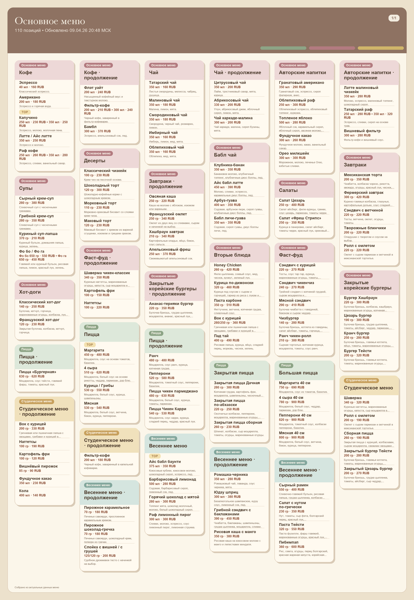
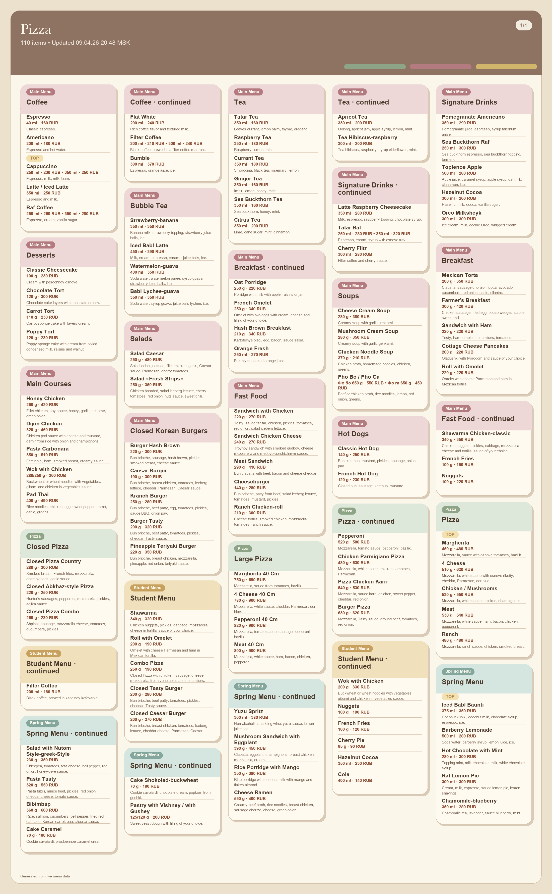

# Cava Menu Bot

A Telegram bot and admin panel for browsing and updating the Cava cafe menu in real time.

## Demo

### Telegram menu render



### English pizza menu



## Product Context

### End users

- Innopolis University students
- university staff
- campus visitors
- Cava staff who update menu data

### Problem

During busy hours people often have to walk to the cafe counter just to see what is currently available. This wastes time and creates extra crowding near the menu boards.

### Solution

`Cava Menu Bot` gives users the current menu in Telegram and provides staff with a protected web admin panel for editing dishes, prices, availability, and seasonal menu collections.

## Features

### Implemented

- backend API built with `FastAPI`
- `SQLite` database for menu items, users, and seasonal menus
- Telegram bot with language switching and image-based menu output
- protected admin panel built with `React + Vite`
- super-admin account management for staff access
- multilingual menu fields: Russian and English
- generated menu images cached on disk for fast bot responses
- single-command Docker deployment with `docker compose`

### Not Yet Implemented

- public analytics dashboard for popular menu sections
- automatic OCR import from new poster photos
- push notifications when new seasonal menus appear
- public web view of the customer menu outside Telegram

## Usage

### End users

1. Open the Telegram bot.
2. Send `/start`.
3. Use buttons to switch between menu groups and languages.
4. Open the sold-out view to see dishes that are currently unavailable.

### Staff

1. Open the admin panel in the browser.
2. Log in with a staff or super-admin account.
3. Edit dishes, prices, availability, and multilingual fields.
4. Create new seasonal menus or restore deleted ones.

### Super admin

1. Open the `Сотрудники` section.
2. Create staff accounts.
3. Reset passwords or disable access when needed.

## Deployment

### Target VM OS

- `Ubuntu 24.04`

### What should be installed on the VM

- `git`
- `docker`
- Docker Compose plugin (`docker compose`)

### Step-by-step deployment instructions

1. Clone the repository:

   ```bash
   git clone <your-repo-url> se-toolkit-hackathon
   cd se-toolkit-hackathon
   ```

2. Create environment files:

   ```bash
   cp .env.example .env
   cp .env.bot.example .env.bot
   ```

3. Open `.env.bot` and set `BOT_TOKEN` if you want the Telegram bot to run inside the same container.

4. Start the whole product:

   ```bash
   docker compose up --build -d
   ```

5. Open the product:

   - `http://<vm-ip>:8000` for the admin panel
   - `http://<vm-ip>:8000/docs` for backend API docs

6. Stop the product when needed:

   ```bash
   docker compose down
   ```

### Notes

- The backend serves the built frontend from the same container.
- If `BOT_TOKEN` is empty, the web app and backend still run, and only the Telegram bot is skipped.
- Persistent data is stored in a Docker volume.

## Additional Docs

- [Project plan](docs/project-plan.md)
- [Presentation outline](docs/presentation-outline.md)
- [Demo script](docs/demo-script.md)
- [Submission checklist](docs/submission-checklist.md)
- [Lab 9 requirements copy](docs/lab-9-requirements.md)
